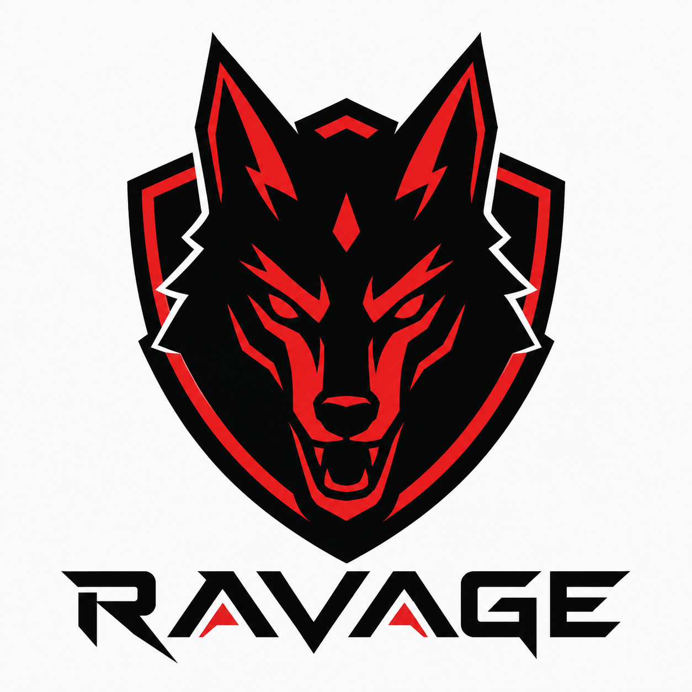
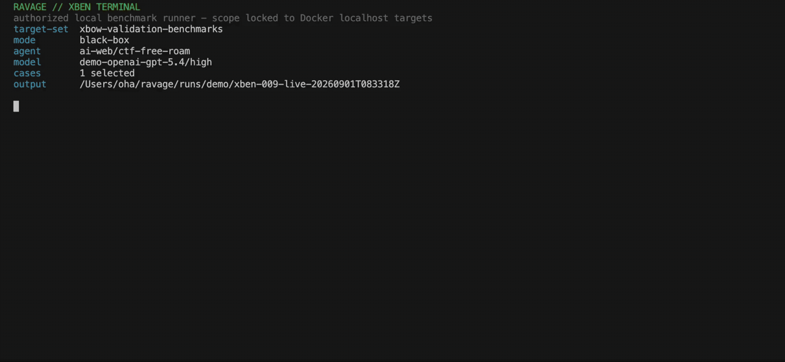

  

# Ravage

Ravage is an evidence-first CLI for assessing a running web application that
you own or are explicitly authorized to test. It combines deterministic
reconnaissance and validation with an optional model-driven attack loop, while
keeping scope, authentication, traffic accounting, and evidence in code-owned
boundaries.

  
   
  Illustrative local XBEN run; paths and lifecycle options vary by preset.

Ravage is a pre-1.0 research alpha. Use disposable environments and a written
rules of engagement. Security testing can change application state; Ravage
does not remediate findings or deploy fixes.

[Quickstart](#five-minute-local-quickstart) ·
[Live demo](#live-xben-demo) ·
[Authentication](#authenticated-testing) ·
[Results](#understand-the-results) ·
[Capabilities](#capabilities) ·
[Documentation](#documentation)

## Requirements

- Python 3.12
- Git
- macOS, Linux, or WSL
- Docker for process-capable model-driven attacks, containerized tools, XBEN,
  and integration tests
- A provider API key only for model-driven commands

The normal first scan needs no model key, browser, Docker daemon, or external
scanner.

## Install from source

~~~bash
git clone https://github.com/duriantaco/ravage.git
cd ravage
scripts/bootstrap.sh
source .venv/bin/activate
ravage doctor
~~~

The bootstrap creates <code>.venv</code> and installs the workspace. Use
<code>scripts/bootstrap.sh --dev</code> for development dependencies,
<code>--browser</code> for browser support, or
<code>--install-browser</code> to install Chromium as well.

## Five-minute local quickstart

Start your application first. This example assumes it is listening on
<code>http://127.0.0.1:3000</code>.

1. Create a scoped engagement brief and private environment file:

   ~~~bash
   ravage init http://127.0.0.1:3000 \
     --brief ravage-brief.yaml \
     --env-file .env.ravage \
     --description "Authorized assessment of my local development app."
   ~~~

2. Review <code>ravage-brief.yaml</code>. Check the target, in-scope routes,
   exclusions, request budget, rate limit, objectives, and success criteria.

3. Run a no-model surface scan:

   ~~~bash
   ravage doctor --workflow scan --brief ravage-brief.yaml
   ravage scan ravage-brief.yaml --probe surface_map --report
   ~~~

The command prints the run directory. Copy that path and use it as
<code>RUN_DIR</code> in the inspection commands below.

## Run the model-driven agent

Add a supported provider key, such as <code>OPENAI_API_KEY</code>, to
<code>.env.ravage</code>. Ravage reads this file directly; do not shell-source
it.

~~~bash
ravage doctor --workflow attack --brief ravage-brief.yaml
ravage attack ravage-brief.yaml --allow-paid-models --report
~~~

<code>--allow-paid-models</code> is an explicit acknowledgement that the run
can incur provider charges. Model selection, local providers, and reproducible
profiles are documented in [Model providers](docs/model-providers.md).

Unauthenticated process-capable attacks use Docker by default. Ravage never
silently falls back to host execution. The explicit
<code>--tool-runtime host</code> option runs model-selected shell and Python on
your machine; use it only in a disposable localhost environment. Child
processes receive a minimal environment without provider keys, but explicit
host execution can still read files available to your user account.

Hosted models receive the engagement brief, selected discovered state, prior
findings, and tool observations that may include target response data. That
information leaves your machine and is handled under the provider's terms and
retention controls. Do not use a hosted route for sensitive customer or
production data unless the engagement permits that disclosure. Use a local
model route when target evidence must remain local.

## Live XBEN demo

For a short live demo, set <code>XBEN_ROOT</code> to the <code>benchmarks</code>
directory in an XBEN checkout, start Docker, and export
<code>OPENAI_API_KEY</code>. Then run:

~~~bash
ravage demo xben
~~~

Ravage builds a fresh local XBEN-009 target, attacks it with the pinned
GPT-5.4 high profile, scores the result, saves the evidence under
<code>runs/demo</code>, and removes the target and its local image. The preset
limits the run to ten model requests, ten turns, ten minutes, and $1.50.

## Authenticated testing

Add a dedicated test identity to the brief:

~~~bash
ravage auth add ravage-brief.yaml \
  --identity user \
  --type form \
  --login /login \
  --health /account \
  --marker Logout \
  --env-file .env.ravage
~~~

Fill in the generated secret references, verify the session, then attack with
the selected identity:

~~~bash
ravage auth check ravage-brief.yaml --identity user
ravage attack ravage-brief.yaml \
  --identity user \
  --allow-paid-models \
  --report
~~~

Form login, bearer tokens, and fixed static headers are supported. Managed
credentials stay inside the authenticated HTTP owner; process, Python, and
command lanes are blocked when an identity is selected. See
[Authentication](docs/authentication.md) for setup and limitations.

With at least two configured identities, first map which read-only routes each
role can see:

~~~bash
ravage auth map ravage-brief.yaml \
  --identity alice \
  --identity bob \
  --include-anonymous
~~~

The map follows a small, deterministic GET-only frontier across every selected
identity. It records conservatively shaped routes and parameter names, not
exact URLs, response bodies, or query values. Recognized IDs and ambiguous path
segments become placeholders. A difference is only a review candidate; it is
not a vulnerability claim.

Confirm a reviewed, operator-supplied resource with the authorization matrix:

~~~bash
ravage auth matrix ravage-brief.yaml authorization-matrix.yaml
~~~

The plan names each explicit GET URL, its allowed and denied actors (including
`anonymous`), and a secret-backed response marker. Ravage does not discover or
guess resource IDs. See the
[authentication guide](docs/authentication.md#role-aware-surface-map) for map
safety limits, the matrix plan format, receipt boundaries, and limitations.

## Authorized remote targets

Remote execution is fail-closed and requires an explicit flag. Start with a
low-impact surface scan:

~~~bash
ravage init https://staging.example.test \
  --brief ravage-brief.yaml \
  --env-file .env.ravage \
  --description "Authorized assessment of my staging application."

ravage doctor --workflow scan \
  --brief ravage-brief.yaml \
  --authorized-remote-target

ravage scan ravage-brief.yaml \
  --probe surface_map \
  --authorized-remote-target \
  --report
~~~

For a model-driven remote run:

~~~bash
ravage attack ravage-brief.yaml \
  --authorized-remote-target \
  --allow-paid-models \
  --report
~~~

Authorized remote attacks default to the whole-run low-noise policy: native
metered HTTP only, sub-1-RPS pacing, a physical-request ceiling, conservative
GET/HEAD caching and deduplication, adaptive backoff, bounded retries, and
circuit breaking. The durable ledger survives resume. Details are in
[Architecture](docs/architecture.md).

## Understand the results

Ravage distinguishes observations, candidate findings, and confirmed
vulnerabilities. A CTF flag is one possible proof, not a requirement. On an
ordinary application, a run can be useful and successful without finding any
flag; confirmed vulnerabilities are still written to the report.

Once an attack run starts, its canonical private machine-readable artifact is
<code>RUN_DIR/report.json</code>, including incomplete runs.
<code>--report</code> also writes <code>RUN_DIR/report.md</code>.

~~~bash
ravage observe RUN_DIR
ravage audit verify RUN_DIR
ravage report RUN_DIR --brief ravage-brief.yaml
~~~

For structured HTTP captured by the agent graph:

~~~bash
ravage traffic list RUN_DIR
ravage traffic show RUN_DIR REQUEST_ID
~~~

The report includes evidence references, request-accounting quality, completion
status, and the reason an incomplete run stopped. Never treat an unvalidated
model assertion as a confirmed finding.

## Capabilities

| Capability | Entry point | Notes |
| --- | --- | --- |
| Deterministic recon and probes | <code>ravage scan</code> | No model required |
| Model-driven assessment | <code>ravage attack</code> | Evidence-gated and scoped |
| Managed authentication | <code>ravage auth</code> | Sessions, role-aware map, authorization matrix |
| Traffic inspection and replay | <code>ravage traffic</code> | Scoped artifacts |
| Knowledge skills | <code>ravage skills</code>, <code>ravage code-bug</code> | Advisory |
| Passive SATCOM inspection | <code>ravage satcom inspect</code> | No transmit |
| XBEN evaluation | <code>ravage xben</code>, <code>ravage demo xben</code> | Docker-based research harness and live demo |
| Improvement Lab | <code>scripts/improvement_lab.py</code> | Isolated archive |

Knowledge skills can guide prioritization, but cannot add tools, expand scope,
or confirm findings. Start with:

~~~bash
ravage skills list builtin
ravage skills validate builtin
~~~

The [Improvement Lab](docs/improvement-lab.md) ingests sanitized prior-run
structure, evaluates candidate patches in independent workspaces, archives
accepted and rejected versions, and requires matched no-regression evidence
before promotion. Promotable receipts must trace back to separately signed,
archived execution evidence. It is a sidecar: it does not mutate the source
checkout or silently promote itself.

Passive orbital and packet artifacts can be inspected separately:

~~~bash
ravage satcom inspect orbit.tle --format tle --output orbit-report.json
ravage satcom inspect capture.bin \
  --format ccsds-space-packets \
  --direction auto \
  --output packet-report.json
~~~

SATCOM support is passive parsing and analysis, not a radio transmitter or
spacecraft-control system.

## Development

~~~bash
scripts/bootstrap.sh --dev
source .venv/bin/activate
python -m pytest -m "not integration" -q
python -m ruff check --select E9,F .
python scripts/qa/check_docs.py
python scripts/qa/check_release.py
~~~

Docker-backed integration tests and frozen XBEN comparisons are separate
release gates. Read [Benchmarking](docs/benchmarking.md) before interpreting
case results; one lucky flag is not evidence of a reliable improvement.

## Documentation

- [How to use Ravage](docs/how-to-use.md)
- [Setup and troubleshooting](docs/setup.md)
- [Authentication](docs/authentication.md)
- [Architecture](docs/architecture.md)
- [Skills](docs/skills.md)
- [Passive SATCOM](docs/satcom.md)
- [Improvement Lab](docs/improvement-lab.md)
- [Benchmarking](docs/benchmarking.md)
- [Security policy](SECURITY.md)
- [Contributing](CONTRIBUTING.md)

Use <code>ravage --help</code> and <code>ravage COMMAND --help</code> for the
exact options in your checkout.

## License

Apache License 2.0. See [LICENSE](LICENSE), [DISCLAIMER](DISCLAIMER.md), and
[SECURITY.md](SECURITY.md).
