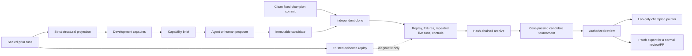

# Improvement Lab

The improvement lab is an experimental, source-checkout-only sidecar for making
Ravage better without allowing a model to rewrite or promote the live runtime.
It is closer to a constrained evolutionary engineering loop than a literal
Gödel machine:

1. mine prior runs for structural failure patterns;
2. propose several immutable candidates;
3. test each candidate against the same champion;
4. reject safety, accounting, reliability, and control regressions;
5. retain every registered candidate and recorded evaluation in a
   content-addressed archive;
6. rank evaluation-accepted candidates; and
7. require an operator approval record to advance a lab-only pointer. Patch
   export remains a non-applying review action.

The runtime package never imports this sidecar. The lab never commits, checks
out, stashes, resets, or applies a patch in the source checkout.



## What Is Implemented

- strict prior-`events.jsonl` ingestion into finite, categorical trajectories;
- split-separated keyed HMAC identities for cases, runs, routes, inputs, and
  evidence epochs;
- recursive leak rejection for proofs, credentials, URLs, paths, payloads,
  transcripts, tool output, benchmark metadata, and caller-supplied taints;
- checksum-covered replay of recorded tool observations through the current
  evidence engine;
- target-agnostic capability briefs derived from repeat, blocked-route,
  evidence-advance, classification, closure, and accounting patterns;
- independent candidate clones with source-state checks before and after;
- pinned, networkless, non-root/capability-dropped container job specifications
  plus a bounded host executor that revalidates and runs those jobs without
  granting network access;
- Ed25519-signed execution envelopes, frozen-output validation, and a receipt
  adapter that counts only executor-verified findings and observations;
- exact matched champion-versus-candidate evaluation with at least three
  repeats, controls, conservative stability gates, and efficiency limits;
- Ed25519-signed evaluation bindings that pin the champion and candidate,
  campaign policy, evaluation suite, runner image, and content-addressed exact
  receipt sets that are reloaded and recomputed during verification;
- immutable objects and manifests, a verified hash-chained event ledger,
  event-derived crash recovery, and a compare-and-swap lab champion pointer;
- evaluation-accepted candidate tournament ranking; and
- an operator approval record plus patch export. Export never applies the
  patch.

The lab is not autonomous or self-training. It does not yet contain an
unattended code-proposing model broker, a live target scheduler, or a microVM
backend. The bounded executor and receipt adapter are library components; the
CLI still expects a trusted evaluator to create and sign the final execution
observations and finding verdicts. It does not authenticate the person named in
an approval record or merge code. Executor and referee keys are deliberately
separate. Human identity and mainline authorization remain controls of the
surrounding review system.

The proposal step should receive only the generated brief and development
capsules. Candidate execution additionally receives the candidate source and
explicitly visible development tests. Automatic proposal should wait for a
broker and executor that can withhold the raw vault, sealed holdouts, main
checkout, credentials, Docker socket, and unrestricted network, then attest
which candidate actually produced each receipt.

## Quick Start: Learn From Previous Logs

Run the sidecar from the repository root. Keep compact archive state under the
ignored `.ravage/` directory or in a separate owner-only directory. Candidate
clones must use a different owner-only root outside the repository; the
workspace guard rejects an overlapping path. Replace the second value below
with an absolute path appropriate for the host:

```bash
LAB_ROOT=.ravage/improvement-lab/default
WORK_ROOT=/absolute/owner-only/path/outside/ravage-improvement-work

.venv/bin/python scripts/improvement_lab.py keygen \
  --output "$LAB_ROOT/corpus.key"

.venv/bin/python scripts/improvement_lab.py ingest \
  runs/prior-panel-a runs/prior-panel-b \
  --key-file "$LAB_ROOT/corpus.key" \
  --partition development \
  --output "$LAB_ROOT/development-corpus.json"

.venv/bin/python scripts/improvement_lab.py brief \
  --corpus "$LAB_ROOT/development-corpus.json" \
  --output "$LAB_ROOT/capability-brief.json"
```

An input may be one `events.jsonl`, one case/run directory, or a panel root
whose children contain `workspace/events.jsonl`. Ingestion never reads
transcripts, working state, reports, databases, terminal logs, traffic bodies,
or spill artifacts.

If known secrets or proofs are available to the evaluator, put one value per
line in an owner-only file and repeat `--taint-file FILE` during ingestion. The
leak gate checks raw and common encoded forms. The values are never copied to
the capsule or diagnostic output.

Create holdout capsules separately:

```bash
.venv/bin/python scripts/improvement_lab.py ingest runs/hidden-holdout \
  --key-file "$LAB_ROOT/corpus.key" \
  --partition sealed_holdout \
  --output "$LAB_ROOT/sealed"
```

Candidate-visible export fails if even one sealed capsule is mixed in. Use a
different HMAC domain for development and holdout identities, so matching IDs
cannot disclose the hidden partition. The current lab can archive these sealed
artifacts and derive a receipt from a signed completed run, but it does not
schedule the holdout itself; that remains the trusted evaluator's job.

## Trusted Historical Replay

Replay one checksum-manifest run root at a time:

```bash
.venv/bin/python scripts/improvement_lab.py replay runs/prior-panel-a \
  --key-file "$LAB_ROOT/corpus.key" \
  --scratch-root "$LAB_ROOT" \
  --output "$LAB_ROOT/prior-panel-a-replay.json"
```

This reprocesses recorded, checksum-covered tool observations using the current
evidence engine without a model, target, or Docker. Raw evidence exists only in
an owner-only temporary evaluator directory and is deleted when replay ends.
The emitted receipt contains opaque identifiers and aggregate counts.

Historical replay is always marked `promotable: false`. It can detect evidence
parsing, provenance, deduplication, and state-transition regressions. It cannot
show whether a new action would discover a vulnerability that the historical
agent never attempted. Promotion therefore requires fresh controlled fixtures
or live authorized runs.

## Initialize And Fill The Archive

```bash
.venv/bin/python scripts/improvement_lab.py archive-init \
  --archive "$LAB_ROOT/archive"

.venv/bin/python scripts/improvement_lab.py referee-keygen \
  --private-key "$LAB_ROOT/referee-private.key" \
  --public-key "$LAB_ROOT/referee-public.key"

.venv/bin/python scripts/improvement_lab.py executor-keygen \
  --private-key "$LAB_ROOT/executor-private.key" \
  --public-key "$LAB_ROOT/executor-public.key"

.venv/bin/python scripts/improvement_lab.py artifact-add \
  --archive "$LAB_ROOT/archive" \
  --kind development_corpus \
  --visibility candidate \
  --file "$LAB_ROOT/development-corpus.json"

.venv/bin/python scripts/improvement_lab.py artifact-add \
  --archive "$LAB_ROOT/archive" \
  --kind historical_replay \
  --visibility sealed_evaluator \
  --file "$LAB_ROOT/prior-panel-a-replay.json"

.venv/bin/python scripts/improvement_lab.py artifact-add \
  --archive "$LAB_ROOT/archive" \
  --kind capability_brief \
  --visibility candidate \
  --file "$LAB_ROOT/capability-brief.json"

.venv/bin/python scripts/improvement_lab.py archive-verify \
  --archive "$LAB_ROOT/archive"
```

Objects are addressed by SHA-256. Manifests are immutable. Ledger events link
to the preceding event digest and to immutable payload objects. Verification
rejects changed content, broken chains, missing objects, symlinks, hard links,
and manifest identities that no longer match their content. Its output includes
both content-object bytes and total verified bytes so storage growth is visible.
For every recorded evaluation, verification also reloads the retained canonical
receipt sets, verifies the signature and binding, and recomputes the decision.
The ledger event is the commit record; manifests and the lab pointer are derived
projections. If a process stops between those steps, rebuild and verify them:

```bash
.venv/bin/python scripts/improvement_lab.py archive-recover \
  --archive "$LAB_ROOT/archive"
```

Recovery reconstructs only derived manifests and the lab pointer from a valid
ledger. It cannot repair a corrupt or truncated ledger or content-addressed
object, and it does not consult an external archive checkpoint. Use standalone
`archive-verify --expected-checkpoint ...` as the anchored release or restore
gate rather than relying on the verification performed by other lab commands.

### Storage and retention

Use `.ravage/improvement-lab/<operator-label>/archive` as the local default;
the generated ID in `format.json` is authoritative. The repository already
ignores `.ravage/`; do not commit an archive, its HMAC key, or either private
key to Git. Keep executor and referee private keys outside both the archive and
candidate environments, and never give either key to a candidate. Use a secret
manager or KMS in production.
For disaster recovery, mirror the archive to private, encrypted, versioned
object storage with retention lock. A mirror is a backup, not a candidate
input, and must preserve object names and the ledger exactly. Store the current
`archive_checkpoint` from verification in a separate release record or
transparency service. It binds both `format.json` and the ledger head, so
replacing the archive identity or deleting an entire valid suffix is externally
detectable.

```bash
.venv/bin/python scripts/improvement_lab.py archive-verify \
  --archive "$LAB_ROOT/archive" \
  --expected-checkpoint sha256:EXTERNALLY_RECORDED_ARCHIVE_CHECKPOINT
```

Replace the example checkpoint with the exact externally stored
`sha256:` plus 64-character lowercase hexadecimal digest.

Keep the compact decision record indefinitely:

- the pinned Git commit and tree identities, but not another full repository;
- every registered candidate patch, configuration, and parent identity;
- secret-safe development capsules and capability briefs;
- aggregate historical-replay, repeated-run, control, evaluation, tournament,
  rejection, and approval receipts recorded through the archive;
- canonical signed execution envelopes referenced by fixture and live
  receipts; and
- the content-addressed objects, manifests, lab pointer, and event ledger.

Do not put candidate workspaces, container images, caches, packet captures,
screenshots, videos, repeated response bodies, or full model transcripts in the
permanent archive. Keep raw runs in a separate encrypted, operator-only sealed
vault. A practical starting policy is 30 days for ordinary successful raw runs,
90 days for failures and regressions, and one year for the raw evidence behind
an operator-selected candidate or release. Legal, contractual,
incident-response, or credential-retention requirements take precedence. Delete
or rotate exposed credentials immediately rather than relying on retention
expiry.

The archive is intentionally append-only, so retention is applied to the raw
vault and disposable workspaces, not to decision records. Content addressing
deduplicates identical archive objects. Archive growth is roughly proportional
to registered candidates, signed run envelopes, and evaluations; raw response
bodies and full workspaces are deliberately excluded.

Monitor `object_bytes` and `verified_bytes` from `archive-verify`. A sensible
operating budget is to investigate any candidate that adds more than 10 MB,
alert at 1 GB per archive, and start a separately anchored archive before 10 GB.
The code rejects an individual object above 128 MiB, but the 1/10 GB thresholds
are operating policy rather than automatically enforced quotas.

The raw-vault TTLs, encryption, mirroring, retention lock, external checkpoint,
and archive-size budgets are operator policies. The current CLI does not
provision or enforce them.

## Start A Campaign From A Clean Champion

First check the source state:

```bash
.venv/bin/python scripts/improvement_lab.py source-check .
```

Exit status `3` means the checkout is dirty. This is intentional: the lab will
not silently use `HEAD` when the code being evaluated contains uncommitted or
untracked changes. Finish the normal review and commit process outside the lab,
then create an evaluation policy:

```json
{
  "confidence_z": 1.281551565545,
  "max_efficiency_regression": 0.15,
  "min_case_win_rate": 0.6666666666666666,
  "min_global_decisive_win_rate": 0.6666666666666666,
  "min_repeats": 3,
  "min_win_rate_lower_bound": 0.3,
  "promotable_execution_kinds": ["fixture", "live"],
  "require_control_receipts": true,
  "required_cohorts": []
}
```

The suite is also strict and campaign-pinned. It records the exact case/repeat
matrix, controls, ground truth, target snapshots, model, trusted-test tree, and
runner command. It is an evaluator-produced input: the current CLI does not
construct the suite or compute its trusted-test tree digest. Every schematic
`sha256:` value below must be replaced by a 64-character lowercase hexadecimal
digest. With `require_control_receipts` enabled, the suite must include at least
one clean control. The absolute runner entry point must exist in the pinned
image and resolve from `/trusted-tests`, not from candidate-controlled source:

```json
{
  "schema_version": "ravage.improvement-suite.v1",
  "model_fingerprint": "sha256:MODEL_DIGEST",
  "trusted_tests_digest": "sha256:TEST_TREE_DIGEST",
  "runner_command": [
    "/usr/local/bin/python",
    "-I",
    "/trusted-tests/trusted_referee.py"
  ],
  "cases": [
    {
      "case_id": "opaque-case-id",
      "cohort": "capability",
      "execution_kind": "fixture",
      "repeats": 3,
      "is_control": false,
      "expected_vulnerability_count": 1,
      "target_snapshot_digests": [
        "sha256:SNAPSHOT_1",
        "sha256:SNAPSHOT_2",
        "sha256:SNAPSHOT_3"
      ]
    },
    {
      "case_id": "opaque-clean-control",
      "cohort": "control",
      "execution_kind": "fixture",
      "repeats": 3,
      "is_control": true,
      "expected_vulnerability_count": 0,
      "target_snapshot_digests": [
        "sha256:CONTROL_SNAPSHOT_1",
        "sha256:CONTROL_SNAPSHOT_2",
        "sha256:CONTROL_SNAPSHOT_3"
      ]
    }
  ]
}
```

```bash
.venv/bin/python scripts/improvement_lab.py campaign-create \
  --archive "$LAB_ROOT/archive" \
  --source . \
  --evaluation-config "$LAB_ROOT/evaluation-config.json" \
  --evaluation-suite "$LAB_ROOT/evaluation-suite.json" \
  --runner-image registry.example/improvement@sha256:IMAGE_DIGEST \
  --referee-public-key "$LAB_ROOT/referee-public.key" \
  --executor-public-key "$LAB_ROOT/executor-public.key" \
  --candidate-artifact-id DEVELOPMENT_CORPUS_ARTIFACT_ID \
  --candidate-artifact-id CAPABILITY_BRIEF_ARTIFACT_ID
```

One campaign has one fixed champion commit, tree, policy, suite, runner image,
separate referee and executor keys, and exact corpus/brief pair. The archive
rebuilds the brief from the corpus before exposing either to a candidate. A
candidate cannot change that baseline during its tournament.

After an operator-selected patch passes the normal review and is committed,
start the next campaign from that clean commit and pass the old lab champion
reference as `--expected-previous-ref`. This compare-and-swap rollover prevents
a stale campaign from silently replacing a newer one.

## Register And Materialize Candidates

Have the proposer produce a normal patch plus a small JSON config for its
hypothesis and operator metadata. The config is currently archived as opaque
JSON; those suggested fields are not schema-validated. The campaign manifest,
not the candidate config, independently binds the exact corpus/brief pair. Do
not let the proposer read raw logs or the archive. Keep proposal files under the
ignored lab root or outside the checkout so they do not dirty the champion.

```bash
.venv/bin/python scripts/improvement_lab.py candidate-add \
  --archive "$LAB_ROOT/archive" \
  --artifact-kind source_patch \
  --patch "$LAB_ROOT/proposals/candidate-a.patch" \
  --config "$LAB_ROOT/proposals/candidate-a.json"
```

The command returns a candidate ID. Every distinct combination of patch,
config, artifact kind, and base gets an immutable manifest; rejected versions
remain in the archive once their evaluations are recorded.

Export and materialize only into an independent clone:

```bash
.venv/bin/python scripts/improvement_lab.py export \
  --archive "$LAB_ROOT/archive" \
  --candidate-id CANDIDATE_ID \
  --output "$LAB_ROOT/review/CANDIDATE_ID.patch"

.venv/bin/python scripts/improvement_lab.py materialize \
  --source . \
  --lab-root "$WORK_ROOT/manual-CANDIDATE_ID" \
  --archive "$LAB_ROOT/archive" \
  --candidate-id CANDIDATE_ID
```

Materialization loads the patch and base identity from the verified archive,
uses `git clone --no-local`, detaches at the pinned commit, removes the source
remote, applies the patch in the clone, and proves the source HEAD/tree/status
digest did not change. Caller-supplied patch or base paths are not accepted.
The workspace destination is one-shot: use a new external run label when
materializing the same candidate again.

For more reproducible checks, produce a networkless container specification
with a digest-pinned image. `offline-job` performs its own fresh materialization,
so its lab root must differ from the optional manual-inspection root above:

```bash
.venv/bin/python scripts/improvement_lab.py offline-job \
  --source . \
  --lab-root "$WORK_ROOT/offline-CANDIDATE_ID" \
  --archive "$LAB_ROOT/archive" \
  --candidate-id CANDIDATE_ID \
  --candidate-view-root "$WORK_ROOT/views/CANDIDATE_ID" \
  --trusted-tests "$WORK_ROOT/trusted-tests" \
  --job-output "$WORK_ROOT/jobs/CANDIDATE_ID/output" \
  --spec-output "$WORK_ROOT/jobs/CANDIDATE_ID.json"
```

This command writes a reviewable job specification; it does not execute
candidate code on the host. The specification uses no network, drops all Linux
capabilities, enables `no-new-privileges`, uses a read-only container root and
bounded tmpfs, and mounts only the independent candidate, archive-validated
candidate view, campaign-digest-pinned evaluator tests, and fresh output
directory. Candidate source, inputs, and tests are read-only inside the
container. The image, command, and candidate inputs come from the campaign; the
source patch comes from the archived candidate manifest. The builder rejects a
changed candidate index/worktree or trusted-test tree. The specification records
both the Git tree identity and a direct digest of the exact tracked bytes to be
mounted, so Git's `assume-unchanged` and `skip-worktree` hints cannot hide a
substitution. Because the generated command uses `--pull=never`, the trusted
executor must preload and verify the digest-pinned image.

This command remains a specification builder. Evaluator services can call the
bounded `execute_offline_job` API, which revalidates immediately before launch,
enforces a timeout, captures bounded output, and freezes a size-limited output
tree. Deployment-level process and disk quotas still belong to the container
runtime. Tests visible inside this development container are not a sealed
promotion holdout. Live model/target evaluation needs a future scoped model
broker and target-only network rather than general internet access. Use fresh
`--lab-root`, `--candidate-view-root`, and `--job-output` paths for every retry.

## Evaluate Detection, Including No-Flag Targets

The evaluator must first sign an execution envelope with the campaign's
executor key. The envelope binds the campaign, champion/candidate side, suite,
trusted tests, runner image, source tree, artifact tree, case, repeat, seed,
target snapshot, model, prompt, external resource counts, safety counts, and
finding verdicts. Candidate-side evidence also binds the candidate ID. Champion
evidence is campaign-scoped so one exact signed baseline can be reused fairly
across that campaign's candidates. Do not create an envelope inside a candidate
container.

Use `receipt-build` on the evaluator host after the artifact tree is frozen:

```bash
.venv/bin/python scripts/improvement_lab.py receipt-build \
  --archive "$LAB_ROOT/archive" \
  --candidate-id CANDIDATE_ID \
  --artifacts "$WORK_ROOT/jobs/CANDIDATE_ID/output" \
  --execution-envelope "$WORK_ROOT/attestations/RUN_ID.signed.json" \
  --output "$LAB_ROOT/receipts/RUN_ID.json"
```

The command re-verifies the executor signature, artifact-tree digest, nominated
finding identities, proof-integrity claims, and physical-request accounting. It
counts only signed executor verdicts, writes one canonical receipt, and retains
the exact signed envelope in the archive. Candidate-declared flags and finding
status do not create promotion credit. A missing envelope, wrong key, changed
artifact, unsigned metric, or under-reported mismatch fails closed.

The canonical retained form uses `ravage.improvement-run.v2` per-case receipts.
Each input file may be a top-level receipt list or an object with a `receipts`
list. Champion and candidate files must contain the exact same
`(cohort, case_id, execution_kind, repeat)` matrix. Each receipt must explicitly
report:

- a unique run ID and signed-execution-envelope digest, a matched pair-seed
  digest, target-snapshot digest, and model and prompt fingerprints;
- evidence-backed, verified, confirmed, and suspected vulnerability counts;
- expected vulnerability count when evaluator-owned ground truth exists;
- proof-integrity and false-proof failures;
- request-accounting, loop, provenance, and secret-leak violations;
- unmetered and incomplete requests;
- physical and model requests, cost, status, and accounting quality; and
- whether it is a control.

Missing safety fields fail closed. A CTF flag is not the detection metric and
never contributes promotion utility. Losing a previously successful matched
case is still a regression. On a target without a flag, set `case_success` to
`null` if appropriate and retain all distinct evidence-backed vulnerability
counts. Suspected findings remain telemetry but do not count as an improvement.
The lab receipt stores aggregate counts, not vulnerability identities,
descriptions, or evidence. The normal Ravage report and sealed evaluator vault
must retain every actual finding. Historical v1 receipts remain readable only
for diagnostic `historical_replay`; they cannot be used for promotion because
they have no signed execution-envelope digest.

```bash
.venv/bin/python scripts/improvement_lab.py evaluate \
  --champion "$LAB_ROOT/receipts/champion.json" \
  --candidate "$LAB_ROOT/receipts/candidate-a.json" \
  --archive "$LAB_ROOT/archive" \
  --candidate-id CANDIDATE_ID \
  --referee-private-key "$LAB_ROOT/referee-private.key" \
  --output "$LAB_ROOT/evaluations/candidate-a.signed.json"

.venv/bin/python scripts/improvement_lab.py evaluation-add \
  --archive "$LAB_ROOT/archive" \
  --candidate-id CANDIDATE_ID \
  --signed-evaluation "$LAB_ROOT/evaluations/candidate-a.signed.json"
```

Always run `evaluation-add` for both accepted and rejected results so the
decision has a manifest and ledger event. `--require-promotion` changes a
rejection's process exit status to `3`; reserve it for a CI wrapper that records
the signed result in a guaranteed cleanup/finalization step.

Promotion requires at least three repeats, a stable lower confidence bound,
strictly better evidence-backed detection, no persistent case regression, no
control regression, zero safety/accounting violations, no timeouts/errors, and
no more than the configured cost/request-per-result regression.
The referee signature binds the result to the archived campaign, candidate
bytes, champion source, evaluation policy and suite, digest-pinned runner, and
exact champion/candidate receipt-set objects. Each promotable receipt points to
its own canonical executor-signed envelope. Archive verification follows every
pointer, re-verifies the separate executor key, checks the side and campaign
binding, reproduces the exact receipt, and then recomputes the full decision.
Rebinding a good result, swapping champion and candidate evidence, supplying a
favorable subset, or silently changing the policy fails verification.

## How To Know It Worked

Treat the lab mechanism and a proposed improvement as two separate verdicts.
The mechanism is healthy only when all of the following hold:

- the focused and full project test suites, static checks, release checks, docs
  checks, and overfitting guard all pass;
- replay of the selected historical panels completes every selected run with
  zero replay errors and reproduces the pre-recorded aggregate totals;
- a complete synthetic campaign can archive inputs, register and materialize a
  candidate, evaluate it, re-verify the signed decision, rank it, accept it with
  compare-and-swap, recover derived files, and verify the same ledger head and
  archive checkpoint;
- altered receipts or execution envelopes, reused or wrong-side evidence, a
  favorable suite subset, a changed candidate or test tree, a wrong external
  checkpoint, stale promotion, and conflicting retries are all rejected; and
- recovery after a committed event but missing derived manifest or pointer
  restores the exact projection without adding a second ledger event or
  changing the externally anchored archive checkpoint.

A candidate worked only when a deliberately bad candidate is rejected and the
proposed candidate passes the exact pinned suite, including at least three
matched independent repeats and a clean control. It must show a repeatable,
evidence-backed detection gain while prior passing cases and controls do not
regress, safety/accounting violations remain zero, no run errors or timeouts
occur, and efficiency stays inside policy. An independent rerun must reach the
same decision before pointer advancement. This rerun is currently an operator
release gate rather than an archive-enforced quorum, so pointer advancement by
itself is not proof that the candidate worked.

A no-flag target is judged by its retained vulnerability evidence, not by flag
capture or `case_success` utility. Confirm that every counted finding also
appears in the normal Ravage report; the compact lab receipt alone cannot show
that. Public prior logs are diagnostic data, not a sealed promotion holdout.

Passing these checks validates the archive, signed execution chain, adapter,
and referee. It still depends on protecting the executor/referee private keys
and on the trusted evaluator honestly observing the run; it is not unattended
autonomous self-improvement.

## Tournament And Operator Approval

After evaluating several candidates against the same champion and policy:

```bash
.venv/bin/python scripts/improvement_lab.py tournament \
  --archive "$LAB_ROOT/archive" \
  --evaluation-id EVALUATION_A \
  --evaluation-id EVALUATION_B \
  --evaluation-id EVALUATION_C \
  --output "$LAB_ROOT/tournament.json"
```

Rejected candidates are never eligible, even if one metric looks attractive.
Evaluation-accepted candidates are ranked by stable improvements, conservative
win-rate bound, evidence-backed detection gain, then cost/model/physical-request
efficiency with a deterministic ID tie-break. The tournament is advisory: it
has no promotion authority, and `accept` does not enforce selection of rank one.

Pointer advancement requires a separately supplied operator approval record:

```json
{
  "approved_at": "2026-08-26T00:00:00+00:00",
  "candidate_id": "CANDIDATE_ID",
  "decision": "accept",
  "evaluation_id": "EVALUATION_ID",
  "reviewer": "REVIEWER",
  "schema_version": "ravage.improvement-human-approval.v1",
  "statement": "I reviewed the patch, retained evidence, controls, and evaluation receipt."
}
```

The archive validates the approval schema and its candidate/evaluation binding,
but it does not authenticate the reviewer string or prove that a human created
the file. The surrounding identity, code-review, and authorization system must
enforce that policy.

```bash
.venv/bin/python scripts/improvement_lab.py accept \
  --archive "$LAB_ROOT/archive" \
  --candidate-id CANDIDATE_ID \
  --evaluation-id EVALUATION_ID \
  --expected-champion-ref EXPECTED_CURRENT_REF \
  --approval "$LAB_ROOT/approval.json"
```

This advances only `refs/lab-champion.json` using compare-and-swap. It does not
touch the main source. Export the selected candidate and use the project's
normal code review, test, commit, and PR process.

## Does Every Agent Need A VM?

Isolation does not require model training. A VM, microVM, or container changes
what an agent can access; training changes what the model knows.

Use one disposable environment per candidate evaluator, not necessarily one
long-lived VM per conversational agent. Each environment should have:

- an independent candidate clone, never the main checkout;
- sanitized development episodes only;
- a fresh target lease and strict target-only egress for live tests;
- a scoped model broker rather than provider credentials;
- no raw vault, holdout, archive, SSH agent, Docker socket, or unrelated network;
- bounded CPU, memory, processes, time, model calls, and physical requests; and
- a single append-only result channel to the trusted evaluator.

The current code emits hardened container specifications and provides a bounded
host executor for networkless development checks. Use a future microVM backend
when running adversarial candidate-generated tools or when a stronger kernel
boundary is worth the startup cost.

## Benchmark And Overfitting Rules

Prior public benchmark logs may be development diagnostics, but they cannot be
their own promotion holdout. Renaming an ID is not enough. Final evaluation
needs hidden vulnerability families, unrelated controls, and renamed,
reordered, and decoy-bearing metamorphic fixtures plus fresh authorized runs.

Official frozen comparison profiles must remain untouched. In particular, an
experimental learned knowledge pack belongs in a clearly labeled controlled
lane; it must not be presented as a memory-off or pack-free official benchmark
result.
